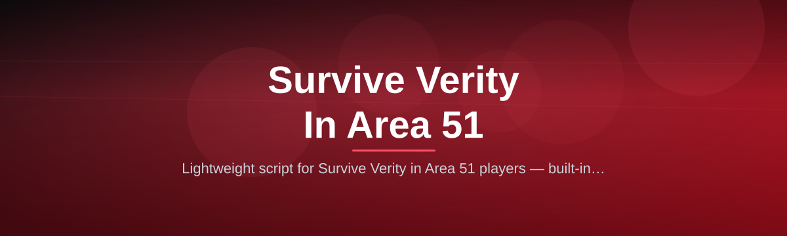
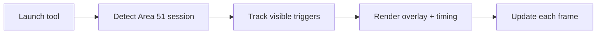

# survive-verity-area51-script

*A focused utility for players who want a smoother, more consistent run through Survive Verity's Area 51 map.*

## What this is

**survive-verity-area51-script** is a standalone Windows tool built around one game: Survive Verity, specifically the Area 51 stage where most players lose time to obscure triggers and unclear escape routes. It doesn't reinvent the game — it gives you a cleaner view of what's happening around you: nearby danger zones, timing windows, and objective locations that the base game keeps hidden or hard to notice mid-run.

The project exists because Area 51 is the point where a lot of runs fall apart — not from difficulty, but from missing information at the wrong second. This tool adds that missing layer of situational awareness without altering how the level itself plays. If you've died to a Verity encounter you didn't see coming, this is built for exactly that moment.

  

The button above opens the project's landing page, where the current build is available to download.

## Who it is for

- **New Area 51 players** who keep dying to the same unmarked trigger zones.
- **Speed-focused players** trying to shave seconds off consistent Verity runs.
- **Returning players** who left after a difficulty patch and need a refresher on current layout timing.
- **Content creators** recording clean runs without narrating every threat manually.

## What you can do

| Capability | What it actually does |
|---|---|
| **Live danger zone overlay** | Marks active threat radii in Area 51 as they trigger, in real time. |
| **Timing window readout** | Shows countdown-style timing for known Verity appearance patterns. |
| **Route markers** | Highlights common extraction points based on current map state. |
| **Low-distraction HUD** | Compact on-screen readout that doesn't block your view during movement. |
| **Session persistence** | Remembers your last settings between launches — no re-configuring each run. |
| **Manual toggle hotkeys** | Turn overlays on/off instantly without opening a menu. |
| **Lightweight footprint** | Runs alongside the game with negligible performance impact. |
| **Offline-safe design** | No background services, no persistent network calls after launch. |

## Getting started

1. Visit the [landing page](https://Splendorsohope.github.io/survive-verity-area51-script/).
2. Download the latest build listed there.
3. Extract the archive to any folder on your Windows machine.
4. Launch the executable, then start Survive Verity as normal.
5. Enable the overlay with the in-tool hotkey once you're in the Area 51 stage.

## Requirements

- Windows 10 or Windows 11 (64-bit)
- No installer, no toolchain, no dependencies to configure
- ~150 MB free disk space
- Survive Verity installed and playable on the same machine

## How it works

The tool reads visible game state on screen and translates it into a lightweight overlay — it does not modify game files or memory.

1. Launch the tool before or after starting the game.
2. It detects when you're in the Area 51 stage.
3. It tracks visible trigger and threat patterns as they occur.
4. It renders a minimal overlay with timing and zone data.
5. The overlay refreshes continuously while you play.

## FAQ

**Does this work with the current version of Survive Verity?**
It's updated against the live Area 51 layout; check the landing page changelog before each session if the game recently patched.

**Will this get my account flagged?**
It only reads and displays on-screen information — it doesn't modify game memory or files. Use at your own discretion regarding the game's terms of service.

**Does it work on Mac or mobile?**
No. This build targets Windows 10/11 only.

**Why is the overlay not showing anything?**
It only activates once it detects you're actually inside the Area 51 stage — it stays idle elsewhere.

**Can I use this with a controller instead of mouse/keyboard?**
Yes, the overlay is purely visual and doesn't intercept your input device.

## Troubleshooting

- **Overlay doesn't appear:** Confirm you're loaded into Area 51, not the lobby or another stage.
- **Tool won't launch:** Right-click the executable → Run as administrator, especially on locked-down Windows setups.
- **Settings reset every launch:** Check that the tool's folder has write permission; some antivirus tools block local saves.
- **Performance drop during runs:** Lower the overlay refresh rate in settings if your machine is running the game near its limits.

## License

Released under the [MIT License](LICENSE). Provided as-is, without warranty. Use in accordance with the target game's terms of service — the maintainers are not responsible for account actions taken by third parties.

  

